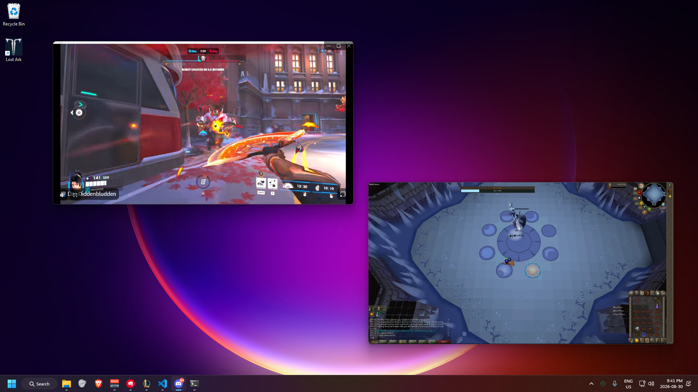

# StreamWindows

A **BetterDiscord** plugin that pops each watched Discord stream into its **own OS
window**, so several streams can be spread across multiple monitors and
fullscreened independently.

## Install

1. Install [BetterDiscord](https://betterdiscord.app). If you run Vencord,
   uninstall it first — they can't coexist.
2. Download **`StreamWindows.plugin.js`** from this repo.
3. Drop it in your plugins folder (Discord → Settings → Plugins → *Open Plugins
   Folder*), or:
   - Windows: `%APPDATA%\BetterDiscord\plugins`
   - macOS: `~/Library/Application Support/BetterDiscord/plugins`
   - Linux: `~/.config/BetterDiscord/plugins`
4. Enable **StreamWindows** in Settings → Plugins.

## Use

Join a voice channel, right-click someone who's streaming, and pick **Pop Out
Stream to Window**. Repeat per streamer for one window each.

- Hover the bottom-left of a popped window for mute, a vertical volume slider
  (0–200%), and a fullscreen button (or double-click the video).
- Window position and size persist per streamer.

Desktop Discord only. Client modification is against Discord's ToS; this is
unofficial and not affiliated with Discord.
